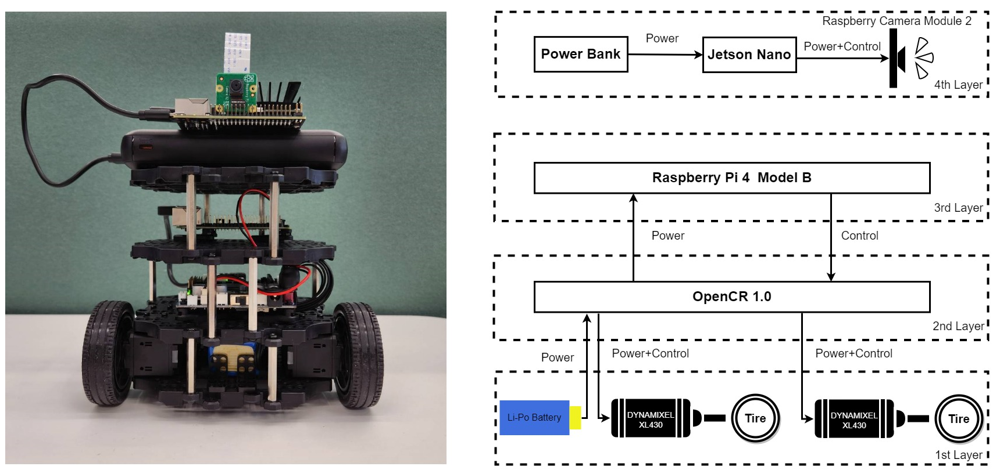
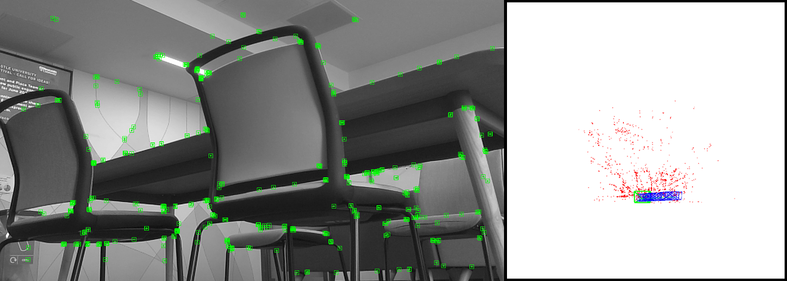
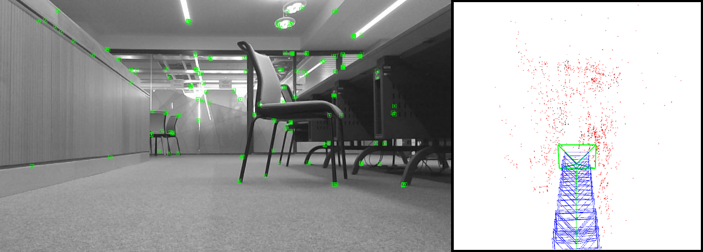
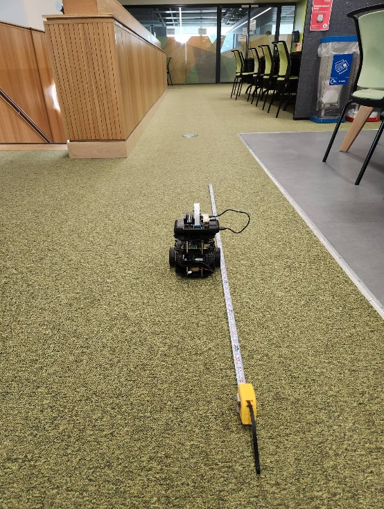

# Visual SLAM for Lightweight Robot

# 1. Introduction

This project was related to my dissertation and was completed during my master's degree in Advanced Computer Science at Newcastle University. The research combines embedded systems and computer vision techniques. Its primary objective is to develop a Visual SLAM system suitable for lightweight robots, showing potential for applications in specialized environments.

This repository contains all the code for this project but this Markdown document only provides a basic introduction to this project. For a deeper understanding, please contact me via email at tzernan.lin.studio@gmail.com.

# 2. The lightwieith robot structure

The lightweight robot used in this research is based on the TurtleBot3 Burger with some modifications. The following picture showcase the fully assembled exterior of it. For detailed information about TurtleBot3, please refer to the following link: https://www.turtlebot.com/turtlebot3/.

# 3. The visual SLAM implementation

This project adopted the open-source ORB-SLAM2 as its foundation and makes appropriate modifications to fit the needs of this research. For detailed information about TurtleBot3, please refer to the following link: https://github.com/raulmur/ORB_SLAM2.

# 4. Demonstration

After development, I utilized ROS to remotely initiate the Visual SLAM program and operate the robot to move indoors, successfully establishing 3D point cloud maps. The screenshots from the experiment are shown in the following pictures. Among them, green square frames represent feature points; blue rectangular frames depict the camera trajectory; black dots indicate map points; and red dots represent temporary map points.

The following picture displays the on-site experiment situation:

